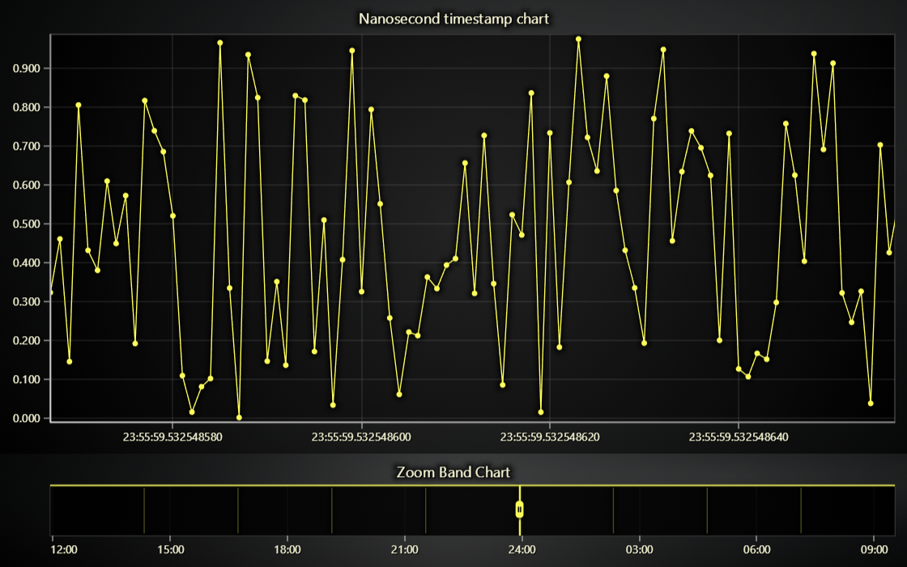

# JavaScript Nanosecond Timestamp Chart

This demo application belongs to the set of examples for LightningChart JS, data visualization library for JavaScript.

LightningChart JS is entirely GPU accelerated and performance optimized charting library for presenting massive amounts of data. It offers an easy way of creating sophisticated and interactive charts and adding them to your website or web application.

The demo can be used as an example or a seed project. Local execution requires the following steps:

-   Make sure that relevant version of [Node.js](https://nodejs.org/en/download/) is installed
-   Open the project folder in a terminal:

          npm install              # fetches dependencies
          npm start                # builds an application and starts the development server

-   The application is available at _http://localhost:8080_ in your browser, webpack-dev-server provides hot reload functionality.

## Description

Demonstration of time series zoom in capabilities of LightningChart JS.

The example loads random generated time series data with **1 nanosecond time step**.
To highlight how difficult this is, normal JavaScript numbers can't even accurately measure timestamps with this accuracy.
Nanosecond timestamps must be loaded as [BigInts](https://developer.mozilla.org/en-US/docs/Web/JavaScript/Reference/Global_Objects/BigInt).

This example showcases 1 day of data with data gaps and total 1 million data points.
By default, the user sees the maximum zoomed in view (approximately 50 nanoseconds).
Below, you can see a zoom band chart showing the complete data set. This is mainly added there to help understand how ridiculous the zoom in magnitude is.

For more details about nanosecond timestamp use cases, please refer to [Developer documentation](https://lightningchart.com/js-charts/docs/more-guides/nanosecond-timestamps/)

## API Links

* [XY cartesian chart]
* [Line series]
* [Axis]
* [Axis tick strategies]

## Support

If you notice an error in the example code, please open an issue on [GitHub][0] repository of the entire example.

Official [API documentation][1] can be found on [LightningChart][2] website.

If the docs and other materials do not solve your problem as well as implementation help is needed, ask on [StackOverflow][3] (tagged lightningchart).

If you think you found a bug in the LightningChart JavaScript library, please contact sales@lightningchart.com.

Direct developer email support can be purchased through a [Support Plan][4] or by contacting sales@lightningchart.com.

[0]: https://github.com/Arction/
[1]: https://lightningchart.com/lightningchart-js-api-documentation/
[2]: https://lightningchart.com
[3]: https://stackoverflow.com/questions/tagged/lightningchart
[4]: https://lightningchart.com/support-services/

© LightningChart Ltd 2009-2025. All rights reserved.

[XY cartesian chart]: https://lightningchart.com/js-charts/api-documentation/v8.0.1/classes/ChartXY.html
[Line series]: https://lightningchart.com/js-charts/api-documentation/v8.0.1/classes/LineSeries.html
[Axis]: https://lightningchart.com/js-charts/api-documentation/v8.0.1/classes/Axis.html
[Axis tick strategies]: https://lightningchart.com/js-charts/api-documentation/v8.0.1/variables/AxisTickStrategies.html

